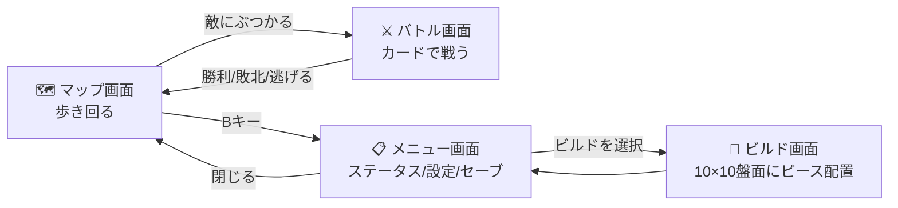
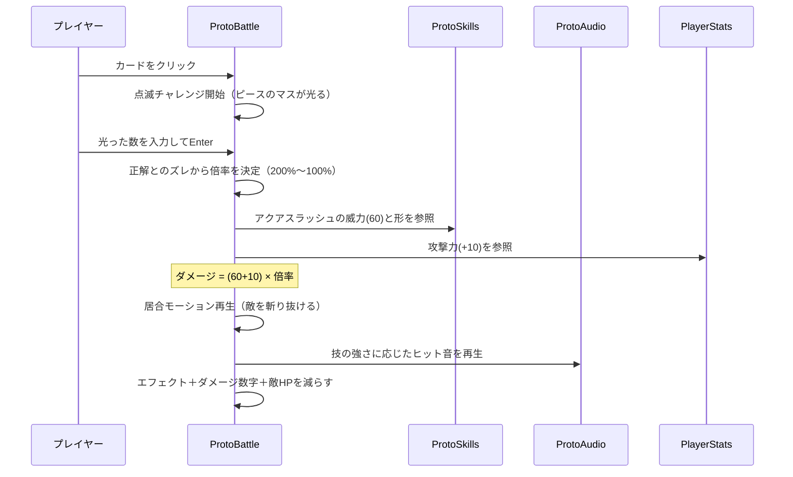

# Project M プロトタイプ ソースコード解説

C#を知らない人でも「どのファイルが何の係か」「処理がどう流れるか」がわかるように書いた資料です。

---

## 1. ゲーム全体の画面構成

このゲームは4つの画面を行き来します。



---

## 2. ソースファイル一覧（役割を一言で）

すべて `Assets/Scripts/Proto/` にあります。

| ファイル | 一言でいうと | 例えるなら |
|---------|------------|-----------|
| **ProtoMain.cs** | ゲーム全体の起動・画面切り替えの司令塔 | 劇場の支配人 |
| **MapScreen.cs** | マップ画面（移動・敵配置・エンカウント） | フィールドの管理人 |
| **ProtoBattle.cs** | バトル画面（ターン進行・演出・チャレンジ） | バトルの審判＋演出家 |
| **BuildScreen.cs** | ビルド画面（ピースの配置・回転・移動） | パズル盤の店主 |
| **MenuScreen.cs** | メニュー画面（ステータス・設定・セーブ） | 受付窓口 |
| **PanelModel.cs** | 10×10盤面の「データだけ」を管理 | 盤面の帳簿係 |
| **ProtoSkills.cs** | スキル6種の定義（名前・威力・ピース形状） | 技のカタログ |
| **ProtoEnemies.cs** | 敵4種の定義（名前・HP・攻撃力・見た目） | モンスター図鑑 |
| **PlayerStats.cs** | MAMAの成長（レベル・EXP・4ステータス） | キャラの履歴書 |
| **ProtoSave.cs** | セーブ・ロード | 金庫番 |
| **ProtoAudio.cs** | BGM・効果音をプログラムで自動生成 | お抱え作曲家 |
| **ProtoPixelArt.cs** | ドット絵をプログラムで自動生成 | お抱え絵師 |
| **ProtoUI.cs** | ボタンや文字を作る共通道具箱 | 大道具係 |

※ `Assets/Scripts/Battle/`・`GameData/`・`UI/` にある古いファイル群（BattleManager等）は、最初に作った練習用バトル（SampleScene用）です。現在のプロトでは使っていません。

---

## 3. ファイル同士の相関図

「誰が誰に指示を出すか」の図です。矢印の向き＝「使う側 → 使われる側」。

```mermaid
flowchart TD
    subgraph 司令塔
        MAIN[ProtoMain<br>起動・画面切替・BGM]
    end

    subgraph 画面たち
        MAP[MapScreen]
        BATTLE[ProtoBattle]
        BUILD[BuildScreen]
        MENU[MenuScreen]
    end

    subgraph データ・道具
        PANEL[PanelModel<br>盤面データ]
        SKILL[ProtoSkills<br>技カタログ]
        ENEMY[ProtoEnemies<br>敵図鑑]
        STATS[PlayerStats<br>成長データ]
        SAVE[ProtoSave<br>セーブ]
        AUDIO[ProtoAudio<br>音の生成]
        ART[ProtoPixelArt<br>絵の生成]
        UI[ProtoUI<br>UI部品の道具箱]
    end

    MAIN --> MAP & BATTLE & BUILD & MENU
    MAIN --> STATS & PANEL & SAVE & AUDIO

    MAP --> ENEMY & ART & UI
    BATTLE --> SKILL & ENEMY & STATS & PANEL & ART & AUDIO & UI
    BUILD --> SKILL & PANEL & UI
    MENU --> STATS & SAVE & ART & UI
```

**ポイント**：
- 下段の「データ・道具」は、上の誰かに**使われるだけ**で、自分からは何もしません（一方通行）。これはGDDの設計原則「データ層→ロジック層→UI層の一方向依存」に沿っています
- 新しい敵や技を増やすときは**図鑑（ProtoEnemies/ProtoSkills）に1行足すだけ**で、画面側のコードは触らなくていい構造です

---

## 4. 各ファイルの中身（やさしい説明）

### ProtoMain.cs — 劇場の支配人
ゲーム起動時に**ただ1人だけ**動き出すファイルです。
- 開演準備：カメラ・Canvas（UIの土台）・4つの画面・BGMをすべて用意する
- セーブデータがあれば復元する
- 「マップを見せて」「バトル開始」と言われたら、**他の画面を隠して目的の画面だけ表示**する
- 画面に合わせてBGMを切り替える（マップ＝のどか、バトル＝激しい）

### MapScreen.cs — フィールドの管理人
- 72ピクセル四方の**マス目の世界**を管理。プレイヤーは上下左右に1マスずつ移動（ポケモン式）
- 移動のたびに「そこは木？敵？」をチェック。**敵のマスに踏み込むと「！」→バトルへ**
- 敵は6体常駐し、数秒ごとに1マスうろつく。倒すと別の場所に新しい敵を補充
- 歩く向きに合わせてキャラの絵（正面/背面/横）と足のコマを切り替える

### ProtoBattle.cs — バトルの審判＋演出家
一番大きなファイル。バトルの全てを仕切ります。
1. **開始**：敵図鑑から渡された敵を表示し、盤面から山札100枚を作って手札3枚を配る（配布アニメ付き）
2. **カード選択**：スキルなら点滅チャレンジ開始。ピースのマスが一瞬光り、数を入力（正解で威力200%）
3. **攻撃**：技ごとの専用モーション（火球/居合/急降下など）→ヒット音→ダメージ数字ポップアップ
4. **敵の反撃**：素早さで回避判定、防御力でダメージ軽減
5. **決着**：勝てばEXP獲得→レベルアップ判定→マップへ

### BuildScreen.cs — パズル盤の店主
- 右の一覧からピースを選び、盤面を左クリックで配置。右クリック撤去、ドラッグ移動、クリック選択→Rキー回転
- 「占有マス数＝そのスキルの出現率%」をリアルタイム表示
- **実際の盤面データはここでは持たず、帳簿係（PanelModel）に全部記録させる**のがミソ。だからバトル画面も同じ帳簿を読んで山札を作れる

### MenuScreen.cs — 受付窓口
- 縦に並んだ項目（ビルド/ステータス/設定/セーブ/閉じる）を矢印キー＋Enterかマウスで選ぶ
- ステータス：履歴書（PlayerStats）の中身を表示
- 設定：音量とBGMのON/OFF
- セーブ：金庫番（ProtoSave）に保存を依頼

### PanelModel.cs — 盤面の帳簿係
- 10×10=100マスの「どこに何のピースが置いてあるか」だけを記録
- 「ここに置ける？」「回転したらはみ出さない？」の判定もここ
- **画面（見た目）のことは一切知らない**純粋なデータ係。だからテストや差し替えが簡単

### ProtoSkills.cs / ProtoEnemies.cs — カタログと図鑑
- 技：名前・威力・ピース形状（マスの並び）・色
- 敵：名前・HP・攻撃力・バトル/マップでの表示サイズ・出現率
- **数値をいじるだけでゲームバランスを調整できる**場所

### PlayerStats.cs — キャラの履歴書
- レベル・EXP・HP・攻撃力・防御力・素早さを記録
- EXPが一定値たまると自動でレベルアップし、4ステータスが上がる

### ProtoSave.cs — 金庫番
- 履歴書＋Wave＋盤面の配置をJSON（テキスト形式）にしてUnityのPlayerPrefs（端末内の保存領域）へ
- 起動時に金庫を開けて、あれば自動復元

### ProtoAudio.cs — お抱え作曲家
- 音楽ファイルを一切使わず、**波形を計算してBGMと効果音を作る**
- フィールド曲（長調・ゆったり）、バトル曲（短調・2倍速・ドラム入り）、ヒット音4段階

### ProtoPixelArt.cs — お抱え絵師
- 文字のマップ（`"..HHSSHH.."` のような行）を1文字＝1ドットとして読み取り、画像に変換
- MAMA・敵4種・歩行スプライト・背景・マップタイルすべてここで生成
- **文字を書き換えるだけでドット絵を編集できる**（未知の文字はマゼンタ色で警告）

### ProtoUI.cs — 大道具係
- 「ここにボタン」「ここに文字」「ここにゲージ」を1行で作れる共通関数集
- 全文字に黒縁取りを自動付与、ゴールドの見出しスタイルなどデザインの統一もここ

---

## 5. 処理の流れを追ってみる（バトル1ターンの例）

「アクアスラッシュのカードをクリックしてから敵に当たるまで」を時系列で：



---

## 6. Unityへの落とし込み方（なぜ動くのか）

### 仕組み：たった1つの部品から全てが生まれる

普通のUnity開発では、ボタンやキャラを**エディタ上で手作業で配置**します。
このプロトは違うアプローチを採っています：

```
proto.unity（シーン）の中身
└── 空のGameObject ×1個
     └── ProtoMain（スクリプト）←これだけ！
```

▶再生ボタンを押すと、ProtoMainの `Awake()`（Unityが自動で呼ぶ初期化関数）が走り、**カメラ設定→Canvas→4画面のUI→キャラのドット絵→BGM、すべてをコードがその場で組み立てます**。

### この方式のメリット・デメリット

| | 説明 |
|---|---|
| ✅ メリット | シーンの手作業ゼロ。コードを直すだけで全部変わる。Git管理が楽（シーンファイルの差分地獄がない） |
| ✅ メリット | 「どこで何が作られているか」が全部コードに書いてあり、追跡できる |
| ⚠️ デメリット | エディタで見た目を直接いじれない（数値を変えて▶で確認の繰り返し） |
| ⚠️ デメリット | 本番開発ではアーティストが作業できないので、**プリプロ専用の手法** |

### Unityの基本概念との対応

| Unity用語 | このプロジェクトでの使われ方 |
|----------|---------------------------|
| **GameObject** | 「物」の入れ物。ProtoMainを載せる1個だけ手作業、残りはコードが生成 |
| **MonoBehaviour** | Unityに「毎フレームUpdate呼んで」等を頼める特別なクラス。画面系ファイルはみんなこれ |
| **Awake / Start / Update** | Unityが自動で呼ぶ関数。Awake=起動時1回、Update=毎フレーム（移動やキー入力はここ） |
| **Canvas** | UIの土台。ProtoUIが1枚作り、全画面がその子として並ぶ |
| **コルーチン（IEnumerator）** | 「0.5秒待ってから次へ」ができる仕組み。バトル演出の順番制御はぜんぶこれ |
| **Sprite / Texture2D** | 画像。ProtoPixelArtがドットを1個ずつ打って作る |
| **AudioClip / AudioSource** | 音の波形と再生機。ProtoAudioが波形を計算して作る |
| **PlayerPrefs** | 端末内の小さな保存領域。セーブデータ置き場 |

### 自分で動かす手順（再掲）

1. Unityで `Assets/Scenes/proto.unity` を開く
2. ▶再生 → マップ画面から始まる
3. 操作：WASD/矢印=移動、B=メニュー、バトル中は数字入力+Enter

---

## 7. よくある「どこを直せばいい？」早見表

| やりたいこと | 触るファイル | 場所 |
|------------|------------|------|
| 技の威力・形を変える | ProtoSkills.cs | `All` のリスト |
| 敵のHP・攻撃力を変える | ProtoEnemies.cs | `All` のリスト |
| ドット絵を描き直す | ProtoPixelArt.cs | 各メソッドの `rows` |
| レベルアップの上昇量 | PlayerStats.cs | `LevelUp()` |
| エンカウント率・敵の数 | MapScreen.cs | 上部の定数 |
| 点滅の時間・回答制限時間 | ProtoBattle.cs | `FlashDuration` / `AnswerTime` |
| クリティカルの倍率 | ProtoBattle.cs | `RunChallenge()` 内の判定 |
| BGMのメロディ | ProtoAudio.cs | `melody` 配列（周波数の並び） |
