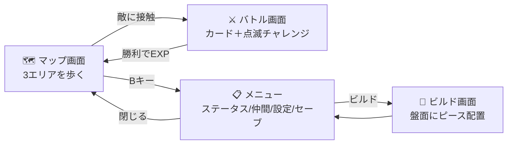
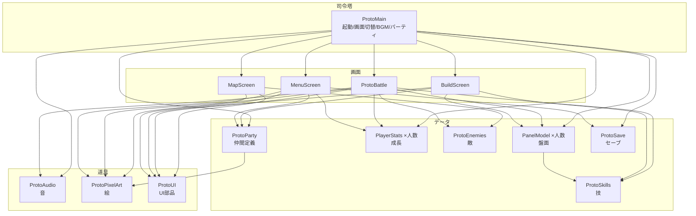
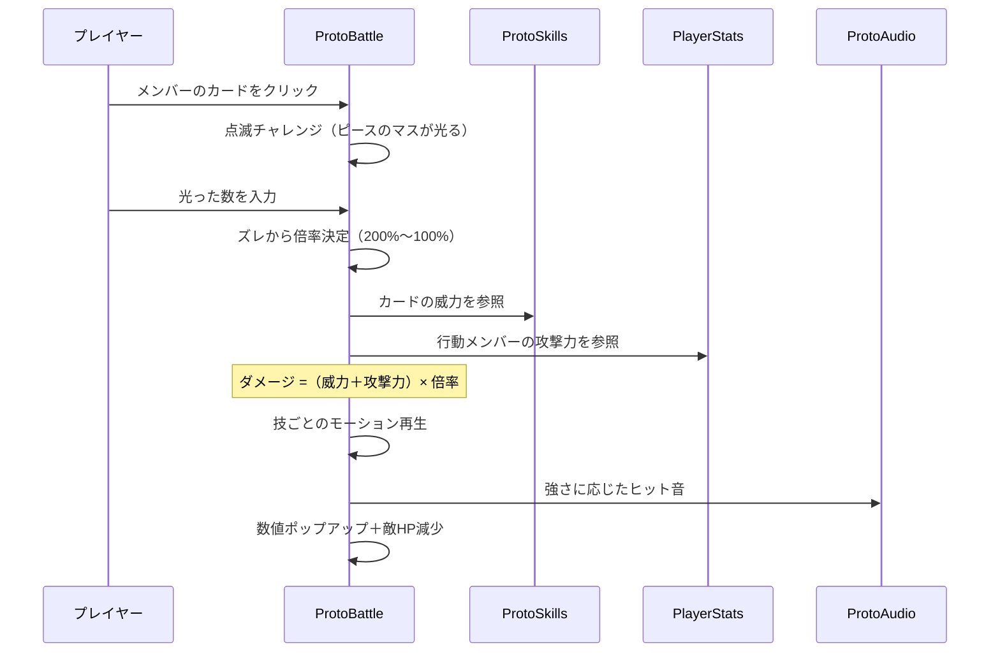

# Project M プロトタイプ ソースコード解説 v2

C#を知らない人でも「どのファイルが何の係か」「処理がどう流れるか」がわかるように書いた資料です。
（パーティ・3エリアマップ・ボス・ATB・サウンドまで反映した最新版）

---

## 1. このゲームは何ができる？

ローグライク育成カードバトル「Project M(仮)」のプリプロ版です。今できることの全体像：

**3つのエリア**：草原（レベル上げ）→ 風雨の森（雨・中ボス「鬼」）→ 嵐の山頂（雷・ボス「ドラゴン」）。
山頂のドラゴンは高レベルなので、草原で鍛えてから挑む構造です。

---

## 2. ソースファイル一覧（役割を一言で）

すべて `Assets/Scripts/Proto/` にあります。行数は規模の目安です。

| ファイル | 行数 | 一言でいうと | 例えるなら |
|---------|-----|------------|-----------|
| **ProtoMain.cs** | 185 | 起動・画面切替・BGM・パーティ管理の司令塔 | 劇場の支配人 |
| **MapScreen.cs** | 594 | 3エリアのマップ（移動・敵・雨・雷・隊列） | フィールドの管理人 |
| **ProtoBattle.cs** | 1355 | バトル全部（ターン/ATB・演出・点滅チャレンジ） | バトルの審判＋演出家 |
| **BuildScreen.cs** | 406 | ビルド画面（メンバー別の盤面編集） | パズル盤の店主 |
| **MenuScreen.cs** | 429 | メニュー（ステータス/仲間/設定/セーブ） | 受付窓口 |
| **PanelModel.cs** | 174 | 盤面のデータと配置判定（形状対応） | 盤面の帳簿係 |
| **ProtoSkills.cs** | 47 | スキル6種の定義 | 技のカタログ |
| **ProtoEnemies.cs** | 130 | 敵6種＋技・出現率の定義 | モンスター図鑑 |
| **ProtoParty.cs** | 47 | 仲間3人＋盤面形状の定義 | 仲間名簿 |
| **PlayerStats.cs** | 34 | レベル・EXP・4ステータスと成長 | キャラの履歴書 |
| **ProtoSave.cs** | 112 | セーブ・ロード | 金庫番 |
| **ProtoAudio.cs** | 262 | BGM4曲・効果音を波形から生成 | お抱え作曲家 |
| **ProtoPixelArt.cs** | 584 | ドット絵・背景・マップタイルを生成 | お抱え絵師 |
| **ProtoUI.cs** | 167 | ボタン・文字・ゲージを作る道具箱 | 大道具係 |

---

## 3. ファイル同士の相関図

矢印の向き＝「使う側 → 使われる側」。

**設計の肝**：
- データ・道具（下段）は**使われるだけ**で自分からは動かない一方通行（GDDの「データ層→ロジック層→UI層」に沿う）
- `PanelModel`と`PlayerStats`は**人数分**存在（パーティ各員が自分の盤面・成長を持つ）
- 敵・技・仲間を増やすときは**図鑑に1行足すだけ**で画面側は無改造

---

## 4. 各ファイルの詳細

### ProtoMain.cs — 劇場の支配人
ゲームに1人だけ。起動時にカメラ・Canvas・4画面・BGM・パーティを用意し、セーブを復元。
- **画面切替**：`ShowMap/ShowMenu/ShowBuild/StartBattle`で目的の画面だけ表示
- **パーティ管理**：`AddPartyMember/RemovePartyMember`（最大3人、1人目MAMA固定）。各員に盤面と成長データを持たせる
- **BGM**：フィールド/バトル/嵐/ボスの4曲を場面で自動切替（ボスは`levelOffset>0`で判定）

### MapScreen.cs — フィールドの管理人
72pxのマス目を上下左右に1マス移動（ポケモン式）。
- **3エリア**：`LoadArea`でエリアごとに地形・敵・環境を組み替え。上端の道で次へ、下端で前へ
- **敵**：マップ上に見えていて接触でバトル。徘徊あり。倒すと消える（ボスは補充しない）
- **環境演出**：エリア2・3は雨、エリア3は雷（数秒おきに稲妻＋雷鳴＋画面フラッシュ）
- **隊列追従**：仲間がプレイヤーの過去位置を辿ってついてくる（ドラクエ式）

### ProtoBattle.cs — バトルの審判＋演出家
最大ファイル。バトルの全てを仕切る。
1. **開始**：敵を表示、メンバーごとに自分の盤面から山札100枚を作り手札3枚を配る
2. **カード選択**：スキルなら点滅チャレンジ（マスが光る→数を入力→正解で威力200%）
3. **攻撃**：技ごとの専用モーション→ヒット音→ダメージ数値ポップアップ
4. **2方式**：ターン制（全員行動→敵）/ ATB（敵ゲージが満ちると攻撃、チャレンジ中は停止）
5. **メンバー個別HP**：誰かが0で戦闘不能、全員で全滅。攻撃力は行動者、防御/回避は被弾者の値
6. **決着**：勝てば全員EXP→レベルアップ。ボスは`levelOffset`ぶん格上

### BuildScreen.cs — パズル盤の店主
上部タブでメンバーを選び、各自の盤面にピースを配置。
- 左クリック配置/右クリック撤去/ドラッグ移動/クリック選択→Rキー回転
- **盤面の形がメンバーで違う**（後述）。配置失敗はエラー表示
- 占有マス数＝そのスキルの出現率%。盤面データは`PanelModel`が持つ

### MenuScreen.cs — 受付窓口
ステータス/ビルド/仲間/設定/セーブ/閉じるを矢印キー＋Enterで操作。
- **選んだだけで右に詳細表示**（ステータス・仲間・設定）
- **ステータス**：メンバータブで各員のレベル・ステータス・立ち絵を確認
- **仲間**：←→で増減　**設定**：音量・BGM・バトル方式（ターン制/ATB）　**セーブ**：金庫番へ

### PanelModel.cs — 盤面の帳簿係
「どこに何のピースがあるか」だけを記録。見た目は知らない純粋データ。
- 形状マスク対応（キャラごとに有効マスが違う／どれも100マス）
- 配置可否・回転・山札生成の判定を担当

### ProtoSkills / ProtoEnemies / ProtoParty — カタログ類
- **技**：名前・威力・ピース形状・色（マザーフレア〜アスラ・レガリア）
- **敵**：HP・攻撃力・技5種・出現率・飛行フラグ・ボスのレベル補正。エリア別出現
- **仲間**：MAMA/アカネ/ソラ（髪色違い）＋各自の盤面形状（正方形/三角形/ひし形）

### PlayerStats.cs — 履歴書
レベル・EXP・HP・攻撃・防御・素早さ。EXPが貯まると自動レベルアップで全能力上昇。

### ProtoSave.cs — 金庫番
全員のステータス・盤面・Waveをセーブ（PlayerPrefsにJSON）。起動時に自動ロード。旧形式互換あり。

### ProtoAudio.cs — お抱え作曲家
音楽ファイル不使用、**波形を計算して生成**。
- BGM4曲：フィールド（長調）/バトル（短調速い）/ボス（重厚な行進曲）/嵐（不穏ドローン）
- 効果音：ヒット4段階・風切り音・雷鳴

### ProtoPixelArt.cs — お抱え絵師
文字マップ（`"..HHSS.."`）を1文字＝1ドットで画像化。
- キャラ（MAMA・仲間・敵6種）、戦闘背景、見下ろしマップタイル（3テーマ）すべて生成
- 文字を書き換えるだけで絵を編集できる

### ProtoUI.cs — 大道具係
「ボタン」「文字」「ゲージ」を1行で作る共通関数集。黒縁取り・金見出しなどデザイン統一もここ。

---

## 5. バトル1ターンの流れ（点滅チャレンジ）

---

## 6. キャラごとの盤面の形（どれも100マス）

ビルドはメンバーごとに別の盤面。形が違うのでビルドの個性が出ます。

| キャラ | 形 | 特徴 |
|--------|-----|------|
| MAMA | 10×10 正方形 | 素直に置ける標準形 |
| アカネ | 三角形（1,3,5…19） | 頂点が狭く悩ましい |
| ソラ | ひし形 | 中央が広く大型ピース向き |

---

## 7. Unityへの落とし込み方

### たった1つの部品から全部生まれる
シーン`proto.unity`には**空のGameObject＋ProtoMain**が1つあるだけ。▶を押すと`Awake()`が走り、カメラ・UI・キャラ・音をコードが全部その場で組み立てます。

| メリット | デメリット |
|---------|-----------|
| シーンの手作業ゼロ、コードだけで全部変わる | エディタで見た目を直接いじれない |
| 「どこで何が作られるか」が全部コードに書いてある | 本番ではアーティストが作業不可（プリプロ専用） |

### Unity用語との対応
| 用語 | 使われ方 |
|------|---------|
| MonoBehaviour | 画面系ファイル。UnityがUpdate等を呼んでくれる |
| Awake/Start/Update | 起動時1回／毎フレーム（移動・入力・雨・雷はUpdate） |
| コルーチン(IEnumerator) | 「0.5秒待ってから次」。演出の順番制御はぜんぶこれ |
| Sprite/Texture2D | 画像。ProtoPixelArtがドットで生成 |
| AudioClip | 音。ProtoAudioが波形計算で生成 |
| PlayerPrefs | 端末内の保存領域。セーブ置き場 |

### 動かす手順
1. `Assets/Scenes/proto.unity` を開く
2. ▶再生 → 草原マップから開始
3. WASD/矢印=移動、B=メニュー、バトルは数字入力＋Enter

---

## 8. 「どこを直せばいい？」早見表

| やりたいこと | ファイル | 場所 |
|------------|---------|------|
| 技の威力・形 | ProtoSkills.cs | `All` |
| 敵のHP・技・出現率 | ProtoEnemies.cs | `All` |
| ボスの強さ | ProtoEnemies.cs | `levelOffset` |
| 仲間の見た目・盤面形 | ProtoParty.cs | `Roster` / `BoardMask` |
| ドット絵 | ProtoPixelArt.cs | 各メソッドの `rows` |
| レベルアップ量 | PlayerStats.cs | `LevelUp()` |
| エンカウント率・エリア構成 | MapScreen.cs | 上部の定数・`LoadArea` |
| 点滅の時間・制限時間 | ProtoBattle.cs | `FlashDuration` / `AnswerTime` |
| BGMのメロディ | ProtoAudio.cs | 各曲の `melody` 配列 |
